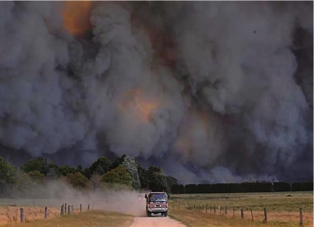

Impacts of Bushfires- one-page site. 

In this reflection, I will talk about my process for the final design and explain what resources I have learnt and used. The idea was on https://www.alishia.net/. They have create some cool animation of each section. 

For this assignment, I have selected Bushfires as my topic. This one-page site show information about the history, impact and effect of bushfire in Australia. To create storytelling, I have created six sections. (About, community impact, Firefighters, Impacts of Forests, wildfires and Impact of water catchments.) To make the one-page site more interactive I have created a scroll vertical & horizontally page. Moreover, I use JavaScript in the menu bar to create a button for the selected section. Lastly, each image user can click to view the image in a larger view. Here is my draft of the one-page design (https://www.figma.com/file/nsMR1GEsrFJXtkizrBPqXa/Untitled?node-id=0%3A1). 

Vertical and horizontally pages JS

Firstly, the main JavaScript scroll horizontally event. I learnt it from FullPage.js (https://alvarotrigo.com/blog/scroll-horizontally-with-mouse-wheel-vanilla-java/). In side the code about 40% I understant how it work and logic of the code and here are my explaintion. 

In the vertical section, there is nothing special need to do. But in the scroll horizontally it was hard. To make it happen <main> element will be the scroll container, in CSS <main> it set overflow-x:hidden, display: flex (into row), view in full screen size used min- width and height as 100vw/vh. The text is justified in the centre. In the JS file, gather information through JavaScript about the scrolling event. 

Const scrollcontainer = document.queryselctor(‘main’);
Scrollcontainer.addventListener(‘wheel’, (evt) =>{
scrollContainer.scrollLeft += evt.deltaY;
});

When combining vertical and horizontally pages. The trick is creating a sticky container with the height of the horizontal scrollable width. This will serve as a placeholder. It will stick to the top while the page scrolls the placeholder vertically without the user noticing, as we have a stick element taking the whole viewport.

Top Navigation bar. 

The navigation bar menu is hidden when clicking the <fa fa-bar - is a display Bars font awesome icon > it will show up list of section {display:block;}. After the user clicks the section, it will go to the section and close up the menu bar. 

Image.

Modal images learnt from https://www.w3schools.com/howto/howto_css_modal_images.asp
A modal is a dialogue box/popup window that is displayed on top of the current page.
<!-- <html> -->
   <!-- tragger img function -->
            
            <!-- the modal -->
            

                <!-- modal content img -->
                
                <!-- modal content text -->
                

            <!--end of function-->
                

<!-- CSS -->

Reference:
-Scroll horizontally with mouse wheel: Vanilla JavaScript-
https://alvarotrigo.com/blog/scroll-horizontally-with-mouse-wheel-vanilla-java/
-Modal images-
https://www.w3schools.com/howto/howto_css_modal_images.asp
